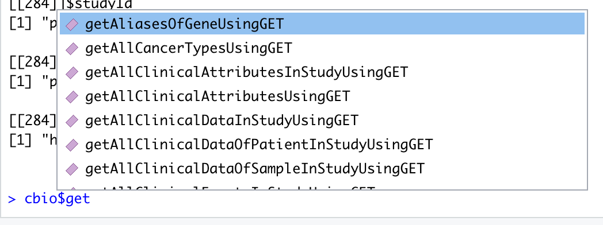
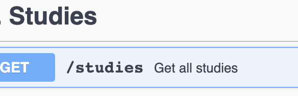
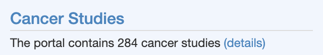
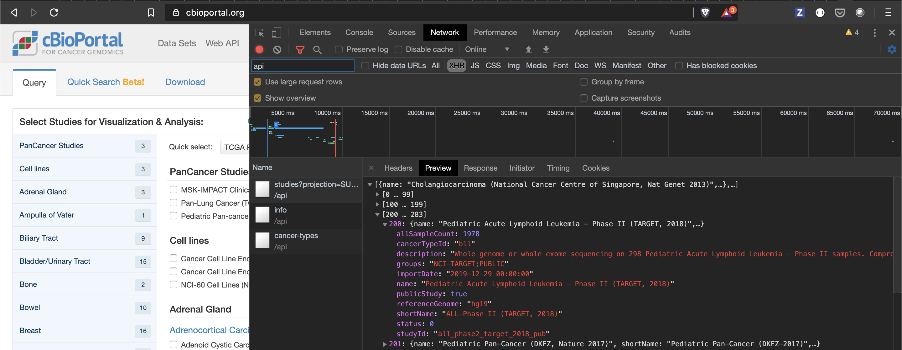
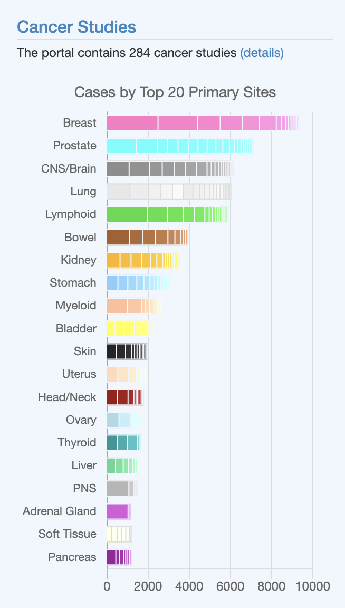
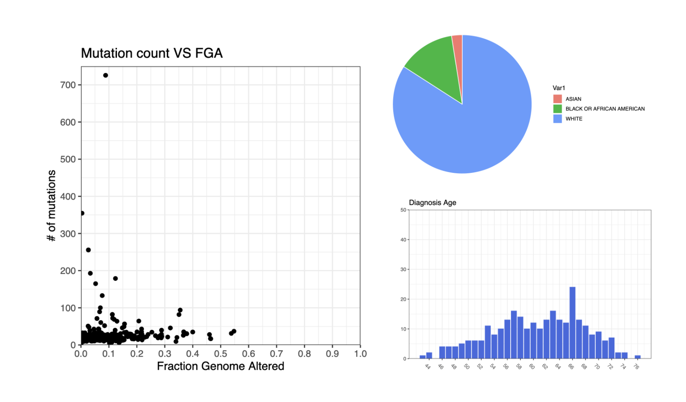
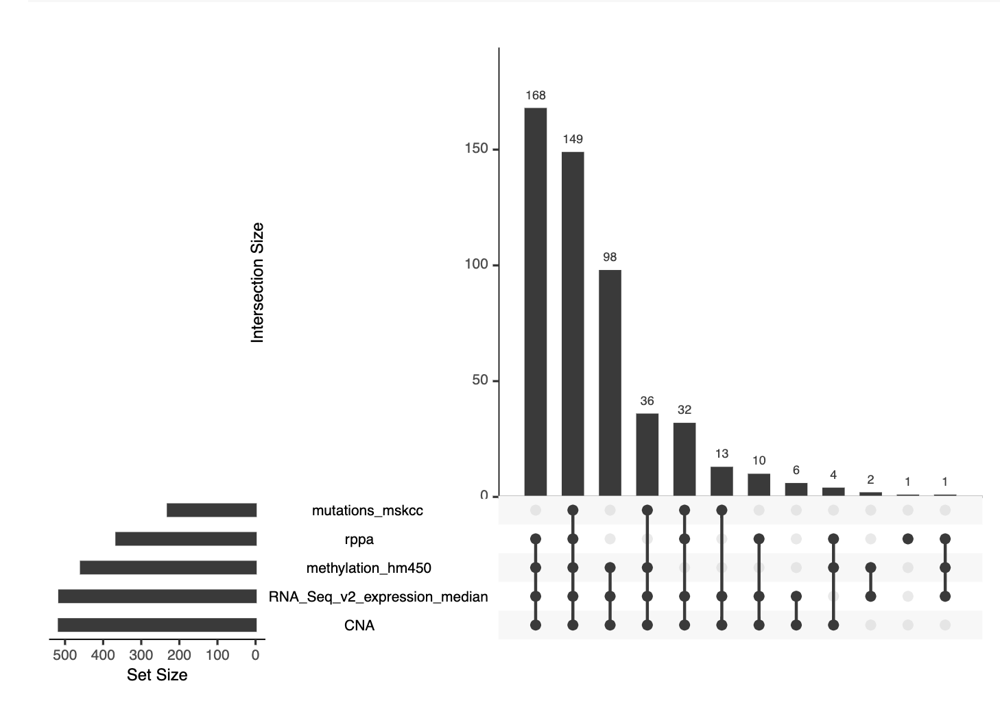
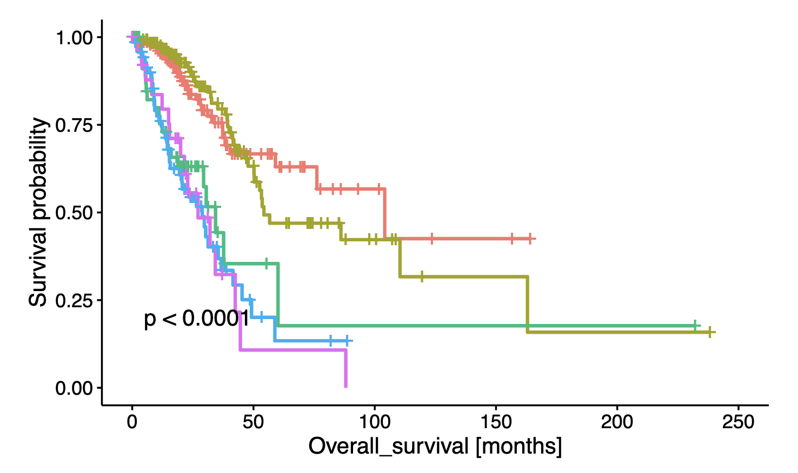

```{r setup, include=FALSE}
knitr::opts_chunk$set(echo = TRUE)
```

## Introduction

This workshop was presented as part of a webinar, see https://www.cbioportal.org/tutorials. It might be useful to look at the slides before following the steps here.

## Installation

For this workshop we use R with the `cBioPortalData` and `AnVIL` packages. We will also be using [RStudio](https://rstudio.com/).

### Using Binder

The easiest way to do the workshop is to run RStudio on [mybinder.org](https://mybinder.org/) by clicking this link:

[](https://mybinder.org/v2/gh/cBioPortal/2020-cbioportal-r-workshop/master?urlpath=rstudio)

This spins up a machine for you on a remote server that you can control through your browser. This Binder environment comes pre-installed with the necessary packages. In RStudio open `workshop.Rmd`. If you open this document in Rstudio it should show a play icon at the top right of the code block below. Click on it and it should run without errors.

```{r message=FALSE, warning=TRUE}
library(cBioPortalData)
library(AnVIL)
```

### Local Installation

#### Using R

After the workshop you might want to install [RStudio](https://rstudio.com/) and [cBioPortalData](https://waldronlab.io/cBioPortalData/) locally on your own machine.

If you already have R>=4.0.0 and RStudio installed and are familiar with installing packages you can install cBioPortalData with:

```{r eval=FALSE}
if (!requireNamespace("BiocManager", quietly = TRUE))
    install.packages("BiocManager")

if (!requireNamespace("cBioPortalData", quietly = TRUE))
    BiocManager::install("cBioPortalData")

library(cBioPortalData)
```

#### Using Bioconda

Alternatively you can use [bioconda](https://bioconda.github.io/user/install.html). This is probably the fastest way to install it if you don't have R and Bioconductor installed yet. After following the instructions on the [Bioconda website](https://bioconda.github.io/user/install.html) you can create an environment with `cBioPortalData` like this:

```
conda create -n cbioportaldata bioconductor-cbioportaldata
conda activate cbioportaldata
```

To use `cBioPortalData` in [RStudio](https://rstudio.com/) you first need to download RStudio from their website. Once installed you can open RStudio from the command line inside of the `bioconda` environment, e.g. for Mac it's like this:

```
conda activate cbioportaldata
open -na /Applications/RStudio.app
```

As a rule of thumb we recommend to create one environment per project/analysis you are working on.

#### Using Docker or Amazon machine images

[Bioconductor](https://www.bioconductor.org/) also offers [Docker images](https://www.bioconductor.org/help/docker/) and [Amazon AMIs](https://www.bioconductor.org/help/bioconductor-cloud-ami/). cBioPortalData is part of Bioconductor since version `3.11`.

## How to use the cBioPortal REST API

Now that the tedious part of installing software is over we can start to use the API.

### Initialize the API client

Initialize the API with the following commands:

```{r paged.print=TRUE}
cbio <- cBioPortal()
cbio
```


This gives an API object in R that allows among other things, access to all the endpoints listed here: https://www.cbioportal.org/api. The object works with tab completion, so if you type `cbio$get` and press the Tab button on your keyboard it will suggest names of various endpoints starting with `get`:


{ width=80% }

### Compute some simple stats

To get an idea of how the client works, let's try to answer a few questions using the API object we just created:

1. how many studies are there?
2. how many cancer types do they span?
3. how many samples in total?
4. which study has the largest number of samples?

#### Find the relevant endpoint
There are several ways to get these answer. One way would be to try and determine the name of the endpoint that would be likely to return this data.

##### Using cBioPortalData

You can list the endpoints by using the Tab completion option shown before or by searching through the endpoints using the `cBioPortalData` function `searchOps`:

```{r}
searchOps(cbio, "studies")
```

The `getAllStudiesUsingGet` endpoint seems quite likely to give the response we are looking for to determine the total number of studies in cBioportal.

##### Using API Documentation

Another way to find the relevant endpoint could be to e.g. browse the API reference with the list of all the endpoints: https://www.cbioportal.org/api/swagger-ui.html. In the `Studies` collection of endpoints it shows there is an endpoint to get all studies:

{ width=30% }

You could click on "Try it Out", press the "Execute" button and notice that the response does indeed have all studies.

##### Using Browser Developer Tools

Lastly, an alternative approach ti find an endpoint if interest is to take advantage of the fact that the homepage ([www.cbioportal.org](https://www.cbioportal.org)) lists how many studies there are:

{ width=50% }

*Note that the total number of studies may differ if you run this workshop at a later date.*

To get the same information programmatically, let's try to figure out what endpoint the homepage is using. Go to www.cbioportal.org and open the "Developer Tools" in your browser (View > Developer Tools). Click on the "Network" tab and filter the requests by `api`. Refresh the homepage again. If you look at the `/api/studies` endpoint you should see something like this:



There are two other endpoints being used but if you look at the response of each you'll notice that only the `/api/studies` endpoint lists the number of studies. There are `284` elements in the response at time of writing, so we know now that the number of elements in this response corresponds to the number of studies.


#### Pull data from the API endpoint using cBioPortalData

Now that we are masters of endpoint searching, let's try to actually get the data into R using the `cBioPortalData` API Object. One could e.g. do

```{r}
resp <- cbio$getAllStudiesUsingGET()
resp
```

This gives an object with info about the HTTP request's response. To parse the response into a more convenient object for analysis use the `httr:content` function:

```{r}
parsedResponse <- httr::content(resp)
cat("Number of elements in the response:", length(parsedResponse))
```

Since we know in this case that each element represents a study, we can answer question 1:

```{r}
cat("Answer 1: There are", length(parsedResponse), "studies in cBioPortal")
```

As you can see, this took quite a few steps. The parsing of responses semi-manually becomes tedious, which is why `cBioPortalData` has all kinds of convenience functions that do this for you. E.g. instead of having to figure out the endpoint for studies one can simply use the function `getStudies`:

```{r}
# First time you run this command it might ask
# to set up a cache folder like:
#
# Create cBioPortalData cache at 
#   /home/jovyan/.cache/cBioPortalData? [y/n]:
#
# If that's the case, open the Console in R Studio and press y
studies <- getStudies(cbio)
studies
```

The `getStudies` function returns a special kind of table (a [tibble](https://tibble.tidyverse.org/)). It allows for easy transformations to help answer the other questions more easily.

You can get the dimensions of the table with `dim` (rows x columns):

```{r}
dim(studies)
```

So we can answer question 1 now with the studies tibble instead:

```{r}
cat("Answer 1: There are", nrow(studies), "studies in cBioPortal")
```

Let's see what all the columns are in this table:

```{r}
colnames(studies)
```

There is a column called `cancerTypeId`, which is exactly what we need for question 2:

```{r}
cat("Answer 2: The studies spans", length(unique(studies$cancerTypeId)), "cancer types")
```

There is also a column caled `allSampleCount` with the number of samples for each study. That will help us answer question 3:

```{r}
cat("Answer 3: There are ", sum(studies$allSampleCount), "samples in cBioPortal")
```

And question 4:

```{r}
cat("Answer 4: The study with the most samples is", studies[which.max(studies$allSampleCount), "name"][[1]])
```

So how could you have known in the beginning that this function `getStudies` existed and avoid the manual parsing of API responses? There is a function in R to list all functions in a package:

```{r}
ls("package:cBioPortalData")
```

A more user friendly page with all functions in the `cBioPortalData` package website can be found at: https://waldronlab.io/cBioPortalData/reference/index.html. Another option is to look at the vignette of the package. Most packages in R include guides on how to use them called "vignettes". You can open them like this:

```{r}
# Note that opening the HTML files does not work on mybinder.org:
browseVignettes(package = "cBioPortalData")
```

In general it is good to first check if there is a function that pulls the data you need in `cBioPortalData`. If it's not there one can resort to parsing the API responses directly as shown before.

### Visualize data

For a simple example of visualizing some data from the API we will try to recreate the barchart from the homepage in R:

{ width=50% }

To make things easier we will use the total number of samples instead of cases. The latter refers to number of patients.

#### Transform data using tidyverse

We still have the studies tibble object from before, which we can reuse. A tibble is an object which is part of the R [tidyverse](https://www.tidyverse.org/). This is an opinionated collection of R packages that are specifically designed for data science. It therefore makes sense to use the [dplyr](https://dplyr.tidyverse.org/) library, which is part of the same universe to manipulate it. They have a nice cheatsheet available that shows common data transformations: https://github.com/rstudio/cheatsheets/blob/master/data-transformation.pdf.

Let's first get the top 20 counts per cancer type:

```{r message=FALSE}
cancerTypeCounts <-                                # assign result to cancerTypeCounts
  studies %>%                                      # %>% is the pipe operator
  group_by(cancerTypeId) %>%                       # and group by cancer type
  summarise(totalSamples=sum(allSampleCount)) %>%  # sum allSampleCount, add column
  arrange(desc(totalSamples)) %>%                  # sort by totalSamples
  top_n(20)                                        # take top 20
```

This might be rather complex if you are not used to `dplyr`, but don't worry about that too much for now. In short we manipulate the data by applying a sequence of functions. Let's print the output:

```{r}
cancerTypeCounts
```

In the output we notice a cancertype called "mixed", which is not in the plot in the homepage. The mixed cancer type indicates that the study contains samples with mixed cancer types. We'll go ahead and exclude those studies for now:


```{r}
cancerTypeCounts <-
  studies %>%
  filter(cancerTypeId != "mixed") %>%              # add filter for mixed type
  group_by(cancerTypeId) %>%
  summarise(totalSamples=sum(allSampleCount)) %>%
  arrange(desc(totalSamples)) %>%
  top_n(20)
cancerTypeCounts
```

Now let's try to plot it:

```{r, fig.height=6, fig.width=6, echo=FALSE}
# sort in ascending order for barchart
cancerTypeCounts <- cancerTypeCounts %>% arrange(cancerTypeCounts$totalSamples)
# add margin to fit axis labels
par(mar=c(4,6,1,1))
barplot(cancerTypeCounts$totalSamples,
        names=cancerTypeCounts$cancerTypeId,
        main= 'Number of samples by Top 20 Primary Sites',
        horiz = TRUE,
        las=1)
```

As you might have noticed the counts differ from the homepage. There are fewer samples in our plot. This is because the homepage also includes the counts for the mixed cancer types. To get the proper label names instead of the short cancer type name, one would have to get the full names from `/api/cancer-types/` or use the `DETAILED` projection on the `/api/studies/` endpoint.

#### Example recreating study view plots

{ width=50% }

The [cBioPortal study view](https://www.cbioportal.org/study/summary?id=prad_tcga_pub) shows a variety of charts. A reproduction of some of these charts can be found [here](./Webinar_Example1.pdf).

#### More visualziation resources

Aside from making visualizations yourself using the`barplot` and `plot` functions (known as r base graphics) or using the popular [ggplot2](https://ggplot2.tidyverse.org/). There are many visualization packages out there to make variations of the plots that one can find on the cBioPortal website. For instance: [maftools](https://bioconductor.org/packages/release/bioc/html/maftools.html), [GenVisR](https://www.bioconductor.org/packages/release/bioc/vignettes/GenVisR/inst/doc/Intro.html), [ComplexHeatMap](https://jokergoo.github.io/ComplexHeatmap-reference/book/a-single-heatmap.html). The tricky part is usually transforming the data to work for the particular tool of interest, but once you've done it you can reuse the code and apply it to any new study that shows up in cBioPortal. This is one of the powerful features of using an API where one can expect the data to always be in the same format.

## What is MultiAssayExperiment?

Once you start pulling more data from the API you will notice it becomes complicated to manage. In some ways you need a data store in R for easy subsetting into data from multiple assays and the corresponding clinical data. This is the key layer that cBioPortalData adds on top of the API: the  [MultiAssayExperiment](https://waldronlab.io/MultiAssayExperiment/). This object makes it very easy to manage all the data. It also abstracts the complexities of using the REST API directly. For a comprehensive overview it is best to check out the website or look at the vignette:

```{r}
# Note that opening the HTML files does not work on mybinder.org:
browseVignettes(package = "MultiAssayExperiment")
```

### Example using MultiAssayExperiment interface 

An example using cBioPortalData MultiAssayExperiment can be found [here](./Example2.pdf). It follows some of the examples found in the `MultiAssayExperiment` vignette and applies them to data from the TCGA study [Lung Invasisve Adenocarcinomas (LUAD)](https://www.cbioportal.org/study/summary?id=luad_tcga):

{ width=50% }

{ width=50% }

## Further reading

- [cBioPortalData](https://waldronlab.io/cBioPortalData/articles/cBioPortalData.html)
- [MultiAssayExperiment](https://waldronlab.io/MultiAssayExperiment/)

More general R and Bioconductor

- [Bioconductor Workshops](https://bioconductor.github.io/BiocWorkshops/)
- [Tidyverse](https://www.tidyverse.org/learn/)
